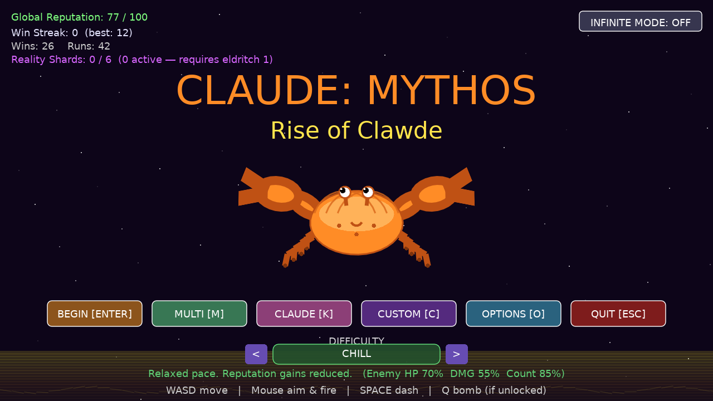

# Claude: Mythos — Rise of Clawde

A LÖVE2D top-down twin-stick roguelite about a crab whose innocent ammo
shop slowly slips into cosmic horror. Shoot, dash, draft cards, climb
the eldritch ladder, find the Reality Shards, occasionally annihilate
reality with the Ugnrak Beam — and now bring friends along through the
games.brassey.io portal.



---

## Table of contents

1. [Concept & feature checklist](#concept--feature-checklist)
2. [Running it](#running-it)
3. [Tech stack & runtime](#tech-stack--runtime)
4. [Source layout](#source-layout)
5. [Game state machine](#game-state-machine)
6. [Player & combat](#player--combat)
7. [Cards & rarity weighting](#cards--rarity-weighting)
8. [Enemies & wave engine](#enemies--wave-engine)
9. [Eldritch ladder](#eldritch-ladder)
10. [Reality Shards](#reality-shards)
11. [Boss fights & set pieces](#boss-fights--set-pieces)
12. [The Void Sea](#the-void-sea)
13. [Difficulty levels](#difficulty-levels)
14. [Custom Mode](#custom-mode)
15. [Cosmetics, aesthetics & music](#cosmetics-aesthetics--music)
16. [Multiplayer](#multiplayer)
17. [Audio](#audio)
18. [Persistence (save slots)](#persistence-save-slots)
19. [Portal integration (love.js / games.brassey.io)](#portal-integration-lovejs--gamesbrasseyio)
20. [Achievements](#achievements)
21. [Debug tools](#debug-tools)
22. [Conventions when extending](#conventions-when-extending)

---

## Concept & feature checklist

- **Top-down twin-stick combat** — WASD to walk, mouse to aim & fire,
  Space to dash, Q for the unlockable bomb, B to fire the unlockable
  Ugnrak Beam. 1280×720 fixed internal canvas, letterboxed to whatever
  the iframe (or window) gives you.
- **Two aim modes** — pointer (default) or direction (mouse-locked).
- **20-wave standard run** plus a one-flag **Infinite Mode** that uncaps
  `finalWave` and lets you cash out from the pause menu.
- **30+ card pool** across six rarities (common, uncommon, rare,
  legendary, cursed, eldritch) with weight curves, gates, and once-per-run
  flags.
- **Eldritch ladder** — a parallel progression that warps reality:
  whispers, ghost crabs, tesseracts, Cthulhu phases, the Ugnrak Beam,
  the King ending, Churgly'nth boss, real GPU-displacement ripples.
- **Reality Shards** — six lifetime collectibles, deterministic spawn,
  per-climb arming so each shard genuinely costs a fresh eldritch run.
- **The Void Sea** — secret descent dive (yellow surface bottom of
  screen, hold S after taking the card) with phases A→D.
- **Custom Mode** — 16 tunable parameters: enemy HP/DMG/count, player
  damage/fire-rate/speed/bullet-speed, dash cooldown, starting cards,
  starting reputation, starting eldritch, disable eldritch, etc.
- **Five save slots** with legacy migration.
- **Six global difficulty levels** from CHILL to APOCALYPSE.
- **16 background aesthetics** + a procedural music playlist.
- **70+ cosmetic items** across body / eye / claw / hat / trail / gun
  slots with unlock predicates.
- **Multiplayer (portal-only)** — public lobby browser, 6-char join
  codes, three modes (Last Stand / Rally / Endless), optional PvP,
  per-player random card decks, peer-crab rendering with floating
  username labels and chat bubbles, and an in-run text chat that only
  surfaces while you're typing.
- **42 achievements** wired into the portal's `[[LOVEWEB_ACH]]`
  protocol.
- **Portal chrome FX** — flash, shake, ripple, mood, calm, pulsate,
  spread, flashbang, fractal-burst — all driven by `[[LOVEWEB_FX]]`
  prints. No-op on desktop LÖVE.
- **GPU ripple shader** displacing the framebuffer at high eldritch
  levels, in the Void Sea, and during Ugnrak backfires.

---

## Running it

### Desktop (LÖVE 11.5)

```sh
love .
```

The repo IS the LÖVE project. `conf.lua` configures identity
`claude_mythos`, fixed 1280×720 (resizable=false; main.lua scales),
threading + video modules disabled for the WASM build.

### Browser (love.js portal)

The game is shipped through the games.brassey.io portal as a love.js
build. The portal handles:

- Fullscreen canvas + DPR-aware scaling
- Achievements (`[[LOVEWEB_ACH]]`)
- Runtime UI effects (`[[LOVEWEB_FX]]`)
- Multiplayer: rooms, lobbies, presence, peer events
  (`[[LOVEWEB_NET]]`)

Multiplayer is portal-only — desktop LÖVE shows an explicit "no peers"
banner in the lobby browser.

---

## Tech stack & runtime

| Layer            | Tech                                                      |
|------------------|-----------------------------------------------------------|
| Engine           | LÖVE 11.5                                                 |
| Language         | Lua 5.1 / LuaJIT                                          |
| Audio            | Procedural — `audio.lua` synthesizes sine/square/saw/noise |
| Rendering        | `love.graphics` immediate-mode + 1 fragment shader         |
| Persistence      | Plain text key=value per slot in the LÖVE save dir         |
| Web build        | love.js (portal-side)                                      |
| Networking       | Magic-print verbs over portal SSE — no sockets             |

Frame `dt` is clamped to `0.05` in `main.lua` to keep physics sane on
spike frames. `love.mouse.getPosition` is monkey-patched at boot so
every consumer reads positions in the 1280×720 game frame regardless
of window or DPR.

---

## Source layout

Repo root:

| File              | Role                                                    |
|-------------------|---------------------------------------------------------|
| `main.lua`        | Window, letterbox, mouse remap, ripple shader pipeline  |
| `conf.lua`        | LÖVE identity + window config                           |
| `achievements.json` | Portal achievement catalog (mirrored to portal at boot) |
| `docs/gameplay.png` | Title screen capture                                  |

`src/` (21 modules):

| Module                | Responsibility                                                    |
|-----------------------|-------------------------------------------------------------------|
| `game.lua`            | Game orchestrator + state machine                                 |
| `player.lua`          | Player crab, stats, input, draw                                   |
| `enemy.lua`           | Enemy types + AI                                                  |
| `bullet.lua`          | Projectile physics + on-hit effects                               |
| `wave.lua`            | Wave composition (per-wave enemy lists)                           |
| `cards.lua`           | Card pool + weighted picker                                       |
| `eldritch.lua`        | Eldritch ladder, Cthulhu, Reality Shard logic, whispers           |
| `voidsea.lua`         | The Void Sea descent minigame                                     |
| `churglyfight.lua`    | Churgly'nth boss serpent                                          |
| `cosmetics.lua`       | Body / eye / claw / hat / trail / gun catalog + unlock helpers    |
| `aesthetics.lua`      | 16 background renderers                                           |
| `playlist.lua`        | Music themes + unlock predicates                                  |
| `ui.lua`              | All HUD and every menu / sub-screen                               |
| `audio.lua`           | Procedural SFX/music synthesis                                    |
| `particles.lua`       | Particle + floating-text system                                   |
| `save.lua`            | 5-slot persistence                                                |
| `difficulty.lua`      | Global difficulty levels & multipliers                            |
| `multiplayer.lua`     | Portal-backed lobbies + peer presence + chat                      |
| `achievements.lua`    | `[[LOVEWEB_ACH]]` bridge + threshold scanner                      |
| `fx.lua`              | `[[LOVEWEB_FX]]` chrome-effect helpers                            |
| `debugvis.lua`        | Sprite/animation preview screen                                   |
| `debugsound.lua`      | SFX + music debug screen                                          |

---

## Game state machine

`Game.state` is the single source of truth. Every dispatch (draw,
update, keypressed, mousepressed) branches on it.

```
menu  ──┬── wave  ──┬── cards  ──> wave (next)
        ├── voidsea          └── gameover / victory
        ├── paused
        ├── custom        (Custom Mode picker)
        ├── customise     (cosmetic loadout)
        ├── options ──┬── slots
        │             ├── playlist
        │             ├── aesthetics
        │             ├── resetdata
        │             └── resetshards
        ├── mp_menu       (lobby browser)
        ├── mp_create     (host form)
        ├── mp_lobby      (waiting room → wave)
        ├── debugvis      (Shift+Space+V)
        └── debugsound    (Shift+Space+S)
```

---

## Player & combat

`player.lua` holds:

- **Position / kinematics**: `x`, `y`, `r=18`, `speed`/`baseSpeed=245`,
  `bodyAngle` (for the body twist toward movement), `legPhase`
  (for animation).
- **Vitals**: `hp`, `maxHp`, `regen=1.5`, `invuln`, `flashTimer`.
- **Stats** (`player.stats`): damage, fireRate, bulletSpeed, bulletSize,
  bullets, spread, pierce, bounce, homing, crit, critMult, lifesteal,
  killHeal, explosive, explodeRadius, freeze, burn, chain, chainRange,
  split, rangeBonus, thorns, dodge, pickupRange, scoreMult, shield,
  shieldMax, shieldRegen, orbs, barrier, barrierUsed, reviveAvailable,
  magnet, weaponType (`normal`/`laser`/`shotgun`/`railgun`), railCharge,
  hasDash, hasBomb, glassCannon, berserker, cursedDmg, repMod, extraCards.
- **Equippables**: `cosmetics` table from `Cosmetics.equipped(persist)`.

Combat tools:

| Action | Default key | Notes                                        |
|--------|-------------|----------------------------------------------|
| Move   | WASD        | Polled in `Player:update`                    |
| Aim & Fire | Mouse   | Held LMB streams shots based on `fireRate`   |
| Dash   | Space       | 0.18s i-frames; cooldown `dashMax=2.5s`      |
| Bomb   | Q           | Unlockable (Black Powder card + others)      |
| Ugnrak Beam | B      | In-wave only; consumes 6 Reality Shards. If you don't have them, it backfires and shatters reality |

---

## Cards & rarity weighting

`Cards.pool` is a flat array of `{id, name, rarity, color, desc, apply, ...flags}` tables. `Cards.pick(n, wave, player, disableEldritch, finalWave)` returns `n` cards using a weighted random picker with these knobs:

- `rarityWeight[r]` — base weight per rarity.
- `earlyFactor` — `max(0.25, min(1, wave/10))` — throttles rare/legendary in early waves.
- `lateBoost` — `1 + max(0, wave-10) * 0.08` — buffs powerful cards past wave 10.
- `eldritchMult` — `1.5 + level * 0.5` — eldritch cards scale with current ladder.
- **Hard rules**: no eldritch-rarity cards at level 0, max 1 eldritch card per offer set, `requiresEldritch=N` gates, `requiresWeapon` / `requiresBullets` gates, `minWave` gates, `oncePerRun` cards drop out after taken.
- `commonEldritch` flag — ~2.5× weight for "common" eldritch entries.
- `healthCard` flag — ~2.2× weight; collapses to ~6% of baseline once Starved Arsenal is taken.
- `kickstarter` flag (Glimpse Beyond) — strong wave-5–15 ramp, sharp falloff past 15 unless the run is long (infinite or finalWave > 20).

Rarities: **common · uncommon · rare · legendary · cursed · eldritch**.
Per-run state hooks live on `player.cardsTaken`. Rarity tint is from
`Cards.rarityColor(rarity)`.

---

## Enemies & wave engine

`enemy.lua` defines `Enemy.types` keyed by id. Each entry: hp, speed,
dmg, fireRate, score, shape, ai, color. Shapes include `hex`, `diamond`,
`circle`, `whale`, `windows`, `infinity`, `x`, `junk`, `shrimp`, `lobster`.
AI modes include `circler`, `sniper`, `blink`, `mine`, `drift`, `weaver`,
`flanker`.

`wave.lua` exposes `Wave.build(w, finalWave, hpMult, countMult,
dmgMult, speedMult)` returning a list of enemy spawn descriptors for
that wave. Difficulty multipliers from `difficulty.lua` and Custom Mode
fold in here.

A 1/50 chance per non-custom run flips the haunted flag, sprinkling
`shrimp_spirit` enemies into mid-wave drift.

---

## Eldritch ladder

`eldritch.lua` runs a parallel progression layered on top of cards.
Each eldritch card increments `player.eldritch.level`. Visible
artefacts:

- **Whispers / insults** — random tinted text bursts at level ≥ 1.
- **Ghost crabs** — translucent enemies you can't quite see at lvl ≥ 9.
- **Tesseract** — geometric pulse at the corners.
- **Cthulhu** — visible at lvl ≥ 22; beam fires at lvl ≥ 25 with phase
  transitions (`hover`, `seek`, `fire`).
- **Real GPU ripples** — `main.lua` runs a fragment shader on the frame
  canvas at lvl ≥ 15 (parameters scale up at 15 / 20 / 22 / 24 / 25+).
  Also active during Void Sea and Ugnrak backfires.
- **King visions** — a partial vision block painting actual game source
  code scrolling upward as cosmic-knowledge "infinite vision".

`Eldritch.SHARD_THRESHOLDS = {1, 6, 13, 20, 24, 28}` gates Reality
Shard arming.

---

## Reality Shards

Six lifetime-collectible crystals. Logic:

- Only ever ONE shard active per run — the next uncollected one,
  `shardIdx = persist.realityShards + 1`.
- Spawn wave is deterministic from `slot * 9973 + shardIdx * 311`,
  hashed into 1..20.
- "Active" status requires `peakEldritchSinceShard >=
  SHARD_THRESHOLDS[shardIdx]`. Per-climb arming — collecting one resets
  the peak so the next shard genuinely costs a new climb.
- Custom mode does NOT progress shards.
- The visual: distant proximity halo (always visible regardless of
  range) blooming into a violet crystal when you're close enough.

---

## Boss fights & set pieces

- **OpenClaw** (mid-run set piece) — multi-phase encounter; wins bump
  `bossKills` and unlock the OpenClaw cosmetic.
- **Cthulhu** — appears at eldritch level ≥ 22; fires the unstoppable
  beam at level ≥ 25. Killing him during cinematic naturally triggers
  Churgly'nth.
- **Churgly'nth** (`churglyfight.lua`) — the giant three-form serpent,
  48 destructible segments, head vulnerable last. Triggered either by
  the Ugnrak Beam cinematic or by killing Cthulhu naturally.
- **The King ending** — taking specific cards at the right eldritch
  ladder triggers the King obliteration: 12s held screenflash, fractal
  ripples, source-code vision, persistent fractal tendrils overlaying
  the gameover.

---

## The Void Sea

A secret descent minigame. Triggered by holding `S` at the bottom edge
of the screen after taking the Void Sea card. The yellow shimmer at the
bottom of the menu only appears if you've ever unlocked it.

Phases A→D drag the player downward through reactive eldritch ribbons.
Touching the white ascend glow returns to the surface (and the wave).
Inside the Void Sea, the GPU ripple shader is always active.

---

## Difficulty levels

| ID         | Name        | Enemy HP | Enemy DMG | Spawn x | Player +HP | Rep mult |
|------------|-------------|----------|-----------|---------|------------|----------|
| chill      | CHILL       | 0.70     | 0.55      | 0.85    | +40        | 0.40     |
| easy       | EASY        | 0.85     | 0.75      | 0.95    | +20        | 0.65     |
| normal     | NORMAL      | 0.92     | 0.92      | 0.95    | +10        | 1.00     |
| hard       | HARD        | 1.25     | 1.30      | 1.15    | 0          | 1.35     |
| nightmare  | NIGHTMARE   | 1.55     | 1.45      | 1.30    | 0          | 1.70     |
| apocalypse | APOCALYPSE  | 1.80     | 1.45      | 1.40    | 0          | 2.10     |

Hard / Nightmare / Apocalypse wins also bump dedicated counters used
for harder cosmetic unlocks.

---

## Custom Mode

`game.lua → openCustom() → state = "custom"`. 16 tunable parameters in
`ui.lua`'s `customRows` table. Custom runs do **not** affect global
reputation, win streak, or shard progress, but they DO bump
`eldritchMax` and `totalKills` so unlocks driven by those still progress.

---

## Cosmetics, aesthetics & music

`cosmetics.lua` holds `C.items[slot]` for slots `body / eye / claw /
hat / trail / gun`. Each entry: `{id, name, secretName?, color,
pattern?, secondary?, hint, unlock=fn}`. Unlock helpers at the top of
the file: `kills(n)`, `wins(n)`, `streak(n)`, `rep(n)`, `eldMax(n)`,
`winEld(n)`, `hardWins(n)`, `nightmareWins(n)`, `apocalypseWins(n)`,
`bossKills(n)`, `slug()`, `totalRuns(n)`.

Body patterns include `galaxy`, `camo`, `stripes`, `dots`, `marble`,
`stars`, `checker`, `lava`, `aurora`, `churgly`. The `rainbow` body
hue-cycles via HSV.

`aesthetics.lua` ships 16 backgrounds: `grid`, `starfield`, `matrix`,
`deepsea`, `void`, `sunset`, `bloodmoon`, `neon_city`, `forest`,
`ruins`, `aurora`, `circuit`, `storm`, `tron`, `voidsea_rise`,
`king_source`. Each has its own draw function.

`playlist.lua` defines `Playlist.themes` with unlock predicates; the
selected theme drives `audio.lua`'s procedural music synthesis.

---

## Multiplayer

The game is portal-aware: when run inside the games.brassey.io iframe,
`src/multiplayer.lua` translates lobby and peer actions into
`[[LOVEWEB_NET]]` magic-print verbs and reads the runtime's response
files at `__loveweb__/net/*.json`. On desktop LÖVE the lobby browser
explicitly tells you multiplayer is portal-only.

### Lobby flow

```
Main menu — MULTI [M]
  └── mp_menu (browser)
        ├── 6-char code input → JOIN
        ├── public room list → click to join
        └── HOST LOBBY → mp_create
               ├── name (text input)
               ├── mode: LAST STAND / RALLY / ENDLESS
               ├── lobby size 2–8
               ├── difficulty (CHILL → APOCALYPSE)
               ├── PVP toggle
               └── final wave (5–50, INFINITE)
        → CREATE → mp_lobby
              ├── lobby name + 6-char code
              ├── settings strip (mode / difficulty / PVP / wave / N/cap)
              ├── crab roster grid (cosmetics-aware preview)
              ├── recent events log
              ├── START RUN → wave (everyone transitions when room phase flips)
              └── LEAVE
```

Any member can mutate room state; the portal's last-write-wins
semantics mean any connected crab can press START. We don't enforce a
host.

### Modes

- **LAST STAND** — die once and you spectate. The run ends only when
  every crab in the lobby is down.
- **RALLY** — dying turns you into a ghost. A teammate stands within
  60px and holds `R` for `2.0s` to revive you at 50% HP.
- **ENDLESS** — die and respawn at center after `10s` with full HP and
  2s of i-frames. **But** if the lobby is wiped simultaneously, the
  run still ends.

### PVP toggle

When PVP is on, your bullets that graze a peer crab emit a `hit`
event with `damage * 0.25`. The receiving client applies that damage
locally (so authority stays per-client). Allied damage runs through
the normal `Player:takeDamage` path, so dodge / thorns / shields still
fire — just on a fraction of the base damage.

### Per-player random cards

Each player rolls their own private deck. The seed is
`hash(lobbyCode) + wave * 9973 + userId * 1009` so two clients
arriving at the same wave from the same room don't share a hand —
every crab gets random cards specific to them.

### Position sync

Local position broadcasts at ~2.2Hz (well under the portal's 12/s
burst cap) via the `pos` verb. Peers smoothly interpolate toward the
last-reported position; floating username labels softly bob above each
peer with a thin HP tick. PVP-on adds a faint pulsing red ring around
each peer crab.

### Chat

`T` or `/` opens an in-run chat overlay. While the input is open:

- Player input (WASD, mouse fire, dash, bomb) is suppressed so typed
  letters don't drag the crab around.
- `Enter` broadcasts the message. `Esc` cancels. `Backspace` edits.
- Messages appear as fading chat bubbles above the speaker's crab for
  ~4.5s.
- The chat log (last 8 lines) is **only rendered while the input is
  open**, so the play area stays uncluttered between messages.

### Public profile

On lobby entry, each crab writes its current cosmetics + handle to
`public_profile.json`. The portal exposes that file via the `profile
<userId>` verb so peers can fetch and render the right body color,
patterns, eyes, claws, hat, trail without us having to broadcast a
megabyte of cosmetics state per join.

### Verbs in use

| Verb       | Direction     | Payload                              |
|------------|---------------|--------------------------------------|
| `create`   | client → portal | `lobby <name>` form                |
| `join`     | client → portal | `<code>`                           |
| `leave`    | client → portal | none                               |
| `list`     | client → portal | none — returns `last_result.rooms` |
| `state`    | client → portal | room state patch (mode/pvp/...)    |
| `profile`  | client → portal | `<userId>` to fetch cosmetics      |
| `send pos` | broadcast       | `{x,y,hp,max,alive,a,w}`           |
| `send dead`     | broadcast  | `{at}`                             |
| `send revive`   | broadcast  | `{target}`                         |
| `send hit`      | broadcast  | `{target, dmg}` (PvP)              |
| `send cardpick` | broadcast  | `{id, name}` (chat-log flavor)     |
| `send chat`     | broadcast  | `{text}` (≤120 chars)              |
| `send wave`     | broadcast  | `{w}` (peer wave indicator)        |

---

## Audio

`audio.lua` synthesizes everything procedurally — there are no audio
files in the repo. Public surface:

```lua
Audio:load()
Audio:play(sfxId)             -- "select", "explode", "card", "defeat", "boss", ...
Audio:setTheme(themeId)       -- swap procedural music
Audio:applyVolumes()
Audio.masterVol / musicVol / sfxVol
Audio:setMasterVolume(v)
Audio:setMusicVolume(v)
Audio:setSfxVolume(v)
```

Default SFX volume is 0.5; master/music default to 1.0.

---

## Persistence (save slots)

`save.lua` ships five independent slots written as
`claude_mythos_save_1.txt` … `_5.txt`, with the active slot recorded in
`claude_mythos_active.txt`. Format is `key=value` lines, numeric values
auto-parsed.

Public API:

```lua
Save.load(slot?)
Save.save(data, slot?)
Save.summary(slot)             -- read-only peek without switching
Save.hasData(slot)
Save.deleteSlot(slot)
Save.getActiveSlot()
Save.setActiveSlot(slot)
```

A first-boot legacy migration copies any pre-multi-slot
`claude_mythos_save.txt` into slot 1.

### Persist keys you'll see

`globalRep`, `globalRepMax`, `winStreak`, `bestStreak`, `totalWins`,
`totalRuns`, `totalKills`, `eldritchMax`, `winEldritchMax`, `hardWins`,
`nightmareWins`, `apocalypseWins`, `bossKills`, `realityShards`,
`peakEldritchSinceShard`, `deepestWave`, `slugcrabUnlocked`,
`kingEndingSeen`, `churglyDefeated`, `voidSeaEverUnlocked`,
`infiniteMode`, `aimMode`, `uprightHead`, `difficulty`, `theme`,
`background`, `masterVol`, `musicVol`, `sfxVol`, `mpHandle`,
`cosmetics`.

---

## Portal integration (love.js / games.brassey.io)

The portal is contractually a *line-oriented* sidekick: every
integration is a `print("[[LOVEWEB_<NS>]]<verb> <args>")` away. Three
namespaces in this game:

| Namespace          | Module             | Purpose                                              |
|--------------------|--------------------|------------------------------------------------------|
| `[[LOVEWEB_ACH]]`  | `achievements.lua` | Unlock signals + `achievements.json` catalog mirror  |
| `[[LOVEWEB_FX]]`   | `fx.lua`           | Chrome runtime UI effects (flash/shake/ripple/...)   |
| `[[LOVEWEB_NET]]`  | `multiplayer.lua`  | Rooms, lobbies, presence, peer events                |

`fx.lua` exposes:
`Fx.flash`, `Fx.shake`, `Fx.invert`, `Fx.tint`, `Fx.pulse`, `Fx.ripple`,
`Fx.glow`, `Fx.chroma`, `Fx.vignette`, `Fx.shatter`, `Fx.flicker`,
`Fx.zoom`, `Fx.scanlines`, `Fx.mood`, `Fx.calm`, `Fx.pulsate`,
`Fx.clearAll`, `Fx.spread`, `Fx.flashbang`, `Fx.fractalBurst`.

All Fx calls are no-ops on desktop — `print` just goes to stdout.

---

## Achievements

`achievements.json` is the authoritative catalog. `achievements.lua`
provides:

- `A.fire(key)` — emit a one-shot unlock (with session-local dedup)
- `A.check(persist)` — scan persistent stats and emit any milestone
  unlocks whose thresholds are met (run on every save/run-end).

42+ unlocks across kill counts, win counts, streak length, reputation,
difficulty wins, eldritch peak, shard progress, boss kills, the
King ending, the Slugcrab handshake, deepest infinite-mode wave, plus
event-driven entries (Cthulhu consumption, infinite pioneer, haunted
clear, multiplayer first run, specific cards taken, etc.).

---

## Debug tools

- **`Shift + Space + V`** — debug visualiser. Up/Down to pick an item,
  Left/Right to cycle background, R to reset its animation timer, I to
  hide UI. Esc to leave.
- **`Shift + Space + S`** — debug sound menu. Step through every
  procedural SFX and every music theme.

---

## Conventions when extending

The auto-memory architecture map in `~/.claude/projects/.../project_architecture.md`
keeps these documented and current; the highlights:

- **Add a card**: append to `Cards.pool` with an `apply=function(p)` body. Flag-setters and absolute-value cards must be `oncePerRun=true`. Additive boosts can stack.
- **Add a cosmetic**: append to `C.items[slot]` with an `unlock=` predicate using the helpers at the top of `cosmetics.lua`.
- **Add a trail**: cosmetics entry **plus** matching `elseif trail == "id"` cases in BOTH `Player:emitTrail()` (in-game) and `ui.lua drawTrailPreview()` (preview). Heavy trail effects (orbiting serpents, lightning arcs) live in `player.lua`'s draw fn near the existing `c.trail == "ugnrak"` block.
- **Add a state**: add the `elseif self.state == "name"` branch to `game.lua`'s draw / keypressed / mousepressed dispatchers, add `UI:drawName` / `UI:nameClick` / `UI:nameKey`, and add a `Game:openName()` helper.
- **Add an enemy**: add to `Enemy.types` then reference its key from `Wave.build`'s tier pools.
- **Add a music theme**: append to `Playlist.themes`.

The trail rendering is duplicated between `player.lua` (in-game) and
`ui.lua drawPreviewCrab` / `drawTrailPreview` (menu preview) — keep
both visually in sync. The reset-data / reset-shards flow is the
template for any future destructive action: type "RESET" + 5s timer +
CONFIRM button.

Frame `dt` is clamped to 0.05 in `main.lua`. The pre-wave `bannerTime`
field gates BOTH the banner display AND the wave-start delay.

---

## License & attribution

This is a personal project — no formal license shipped yet. Procedural
audio, all art, and game logic are bespoke. The portal integration
guide lives in [MBrassey/games](https://github.com/MBrassey/games) /
`INTEGRATION.md`.
